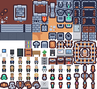

# 🎼 Agent Orchestra

멀티 에이전트 코드 생성 오케스트라. 요청 한 줄을 주면 AI 에이전트 팀이
**기획 → 설계 → 구현 → 검증 → 보강**의 체계를 거쳐 동작하는 프로젝트를 만들어내고,
그 과정을 **2D 픽셀 오피스**에서 실시간으로 보여준다 — 아바타들이 회의하고,
자리에서 코딩하고, 말풍선으로 진행 상황을 알린다.



## 팀 구성 (에이전트)

| 역할 | 하는 일 | 모델 |
|---|---|---|
| 총괄 | 중대 결정 수집, 아키텍처·개발·검증 체계 설계, 태스크 분해 | Claude Fable 5 (고정) |
| 수석 아키텍트 | 구현 전 설계 리뷰 + 검증 후 과잉 설계 코드 리뷰 | Claude Fable 5 (고정) |
| 개발팀 | 백엔드/프론트/디자인/테스트/DevOps 시니어, 태스크당 1명 병렬 구현 | 선택 (Claude/GPT/Gemini) |
| QA | Docker 샌드박스에서 컴파일 + pytest — LLM이 아닌 결정적 검증 | — |
| 트렌드봇 | 실시간 웹 조사로 최신 기술 동향을 설계에 공급 | 선택 (저비용 모델) |
| 전문가 초청 | 규제 도메인·보안 등 특수 지식이 필요하면 총괄이 전담 전문가를 초청 | Fable 5 |
| 경리 | LLM 호출·예산 감시 (한도 초과 전 경고) | — |
| 서기 | 모든 사건을 타임라인 내러티브로 기록 | — |

## 핵심 동작

- **결정은 사람이**: 프레임워크·DB 같은 되돌리기 비싼 결정은 장단점과 추천안을
  들고 회의를 소집해 사용자가 선택 (LangGraph interrupt)
- **설계 리뷰 게이트**: 구현 시작 전 아키텍트가 설계를 비판적으로 검토, 반려 시 재설계
- **실패 원인 특정**: 검증 실패 시 로그에서 원인 파일을 특정해 그 태스크만 재작업
- **격리 검증**: 의존성 설치(네트워크 허용) → 테스트 실행(`--network none`) 2단계,
  생성 코드는 항상 오프라인 컨테이너에서 실행
- **포니테일 스위트**: 과잉 설계 사냥 렌즈(lite/full/ultra/off 강도 조절),
  전체 감사·부채 추적·규모 지표 도구

## 실행

```bash
pip install -r requirements.txt
# Docker Desktop 실행 필수 (검증 샌드박스)
uvicorn server:app --port 8000
# http://localhost:8000 접속 → 하단 설정에서 API 키 연동 → 의뢰하기
```

CLI로도 가능: `python main.py "FastAPI로 할일 관리 API 만들어줘" ./output`

API 키는 UI 하단에서 입력하면 `.env`에 저장된다 (Claude 필수, OpenAI/Gemini는
해당 모델을 쓸 때만).

## 크레딧

캐릭터 스프라이트: 자체 제작 · 배경/가구 타일: [Kenney "Tiny Dungeon"](https://kenney.nl/assets/tiny-dungeon) (CC0)
