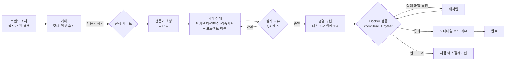

# Agent Orchestra

**요청 한 줄 → AI 에이전트 팀이 설계·구현·검증까지 끝낸 프로젝트.**
그 모든 과정이 2D 픽셀 오피스에서 실시간으로 보인다 — 총괄이 회의를 소집하고,
시니어 개발자들이 자리에서 코딩하고, QA가 서버랙 앞에서 검증하고,
경리가 예산을 감시하고, 서기가 전 과정을 기록한다.

> 컨셉: **"AI SaaS — 웹 기반, 다 만들어드립니다."**
> LangGraph 멀티 에이전트 파이프라인 + FastAPI/SSE + 바닐라 JS 게임 뷰.

## 파이프라인



- **결정은 사람이**: 프레임워크·DB처럼 되돌리기 비싼 결정은 장단점·추천안을 들고
  회의를 소집해 사용자가 선택 (LangGraph interrupt → 게임 내 대화창)
- **설계 리뷰 게이트**: 수석 아키텍트(Fable 5)가 구현 전에 설계를 비판적으로 검토
- **실패 원인 특정**: 검증 실패 시 로그에서 원인 파일을 특정, 그 태스크만 재작업
- **격리 검증**: 의존성 설치(네트워크 허용) → 테스트(`--network none`) 2단계.
  생성 코드는 항상 오프라인 컨테이너에서 실행
- **프로젝트 폴더**: 총괄이 설계 시 이름을 지어 `projects/<이름>/`에 생성.
  UI에서 폴더명 변경 가능

## 팀 구성

| 역할 | 하는 일 | 모델 |
|---|---|---|
| 총괄 | 결정 수집, 체계 설계(아키텍처·컨벤션·검증계획), 태스크 분해 | 선택 (기본 Fable 5) |
| 수석 아키텍트 | 구현 전 설계 리뷰 + 검증 후 과잉 설계 코드 리뷰 | 선택 (기본 Fable 5) |
| 개발팀 | 백엔드/프론트/디자인/테스트/DevOps 시니어, 병렬 구현 | 선택 (Claude/GPT/Gemini) |
| QA | Docker 샌드박스 결정적 검증 — LLM 아님 | — |
| 트렌드봇 | 실시간 웹 조사로 최신 기술 동향을 설계에 공급. **Gemini 선택 시 Google 검색 그라운딩으로 직접 조사** | 선택 (기본 Haiku) |
| 초청 전문가 | 규제 도메인·보안 등 특수 지식이 필요하면 총괄이 초청 | 총괄과 동일 |
| 경리 | LLM 호출·예산 감시, 한도 전 경고 | — |
| 서기 | 전 과정을 타임라인 내러티브로 기록 | — |

## 멀티 프로바이더 & 인증

- **모델**: 역할별로 UI에서 선택 — Claude (Fable 5 / Opus 4.8 / Sonnet 5 / Haiku 4.5),
  OpenAI (GPT-5.1 / GPT-5), Google (Gemini 3 Pro / 2.5 Pro / 2.5 Flash)
- **역할별 전문성 활용**: 유틸(트렌드봇)에 Gemini를 고르면 DDG 스크래핑 대신
  Gemini의 Google 검색 그라운딩으로 검색·요약을 한 호출에 처리 (실패 시 자동 폴백)
- **Claude 인증 2가지**:
  - **API 키** — Anthropic Console 크레딧 결제
  - **구독 (Claude Code)** — Pro/Max/Team 구독으로 호출. 비밀번호는 앱을 거치지
    않는다: Claude Code CLI에 한 번 로그인(브라우저 OAuth)하면 그 세션을 재사용
- API 키는 UI 하단에서 입력 → 로컬 `.env`에만 저장 (마스킹 조회만 제공)

## 포니테일 스위트 (과잉 설계 방지)

| 기능 | 설명 | 비용 |
|---|---|---|
| 강도 조절 | lite / full / ultra / off — 설계·코드 리뷰의 단순화 렌즈 강도 | — |
| 코드 리뷰 | 검증 통과 후 삭제·병합 가능성 리뷰 (자문형, 파이프라인 내장) | LLM 1회 |
| 전체 감사 | 출력 프로젝트 전체 스캔 — 복잡도·데드코드 보고서 | LLM 1회 |
| 부채 추적 | TODO/FIXME/HACK 주석 추적 | 무료 |
| 규모 지표 | 파일 수·줄 수·의존성·큰 파일 TOP5 | 무료 |

스킬은 `skills/*.md` — 파일 추가만으로 리뷰 기준 확장.

## 실행

```bash
pip install -r requirements.txt
# Docker Desktop 실행 (검증 샌드박스용 — 이미지는 첫 검증 때 자동 빌드)
uvicorn server:app --port 8000
# http://localhost:8000 → 하단 설정에서 인증 연동 → 의뢰하기
```

CLI: `python main.py "FastAPI로 할일 관리 API 만들어줘" ./projects`

- 웹 서버는 도커 없이 도는 일반 파이썬 프로세스. 도커는 검증 단계에서만 사용
- 그래프 상태는 `orchestra.db`(SQLite)에 영속화 — 서버 재시작에도 유지
- 새로고침해도 진행 중 실행에 자동 재연결 (히스토리 재생)

## 기술 스택

LangGraph (Send 병렬 fan-out, interrupt, SqliteSaver) · LangChain
(Anthropic/OpenAI/Google) · Claude Agent SDK (구독 인증) · FastAPI + SSE ·
바닐라 JS Canvas (게임 뷰) · lucide 아이콘 · Docker (검증 샌드박스)

## 크레딧

캐릭터·사무실 픽셀 아트: 자체 제작
